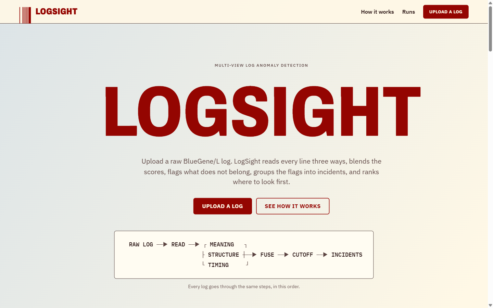
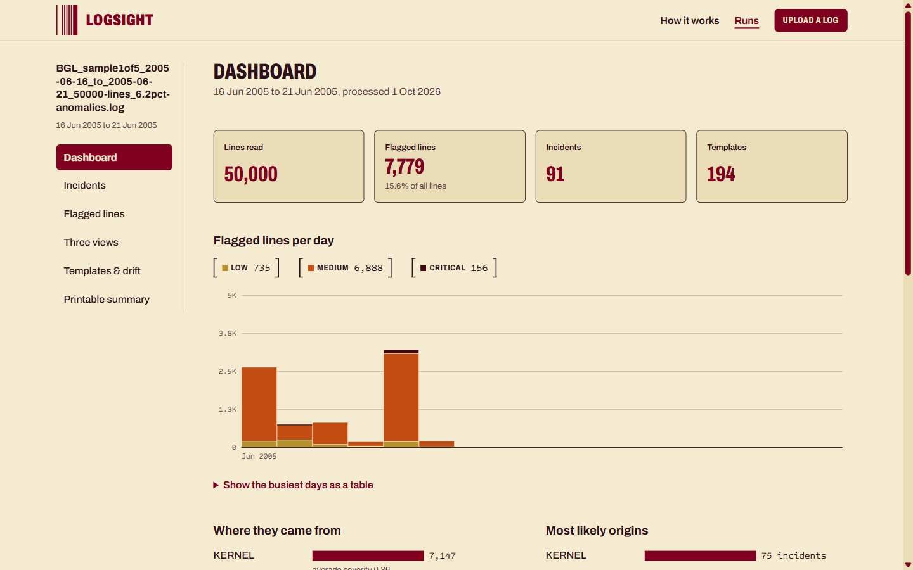
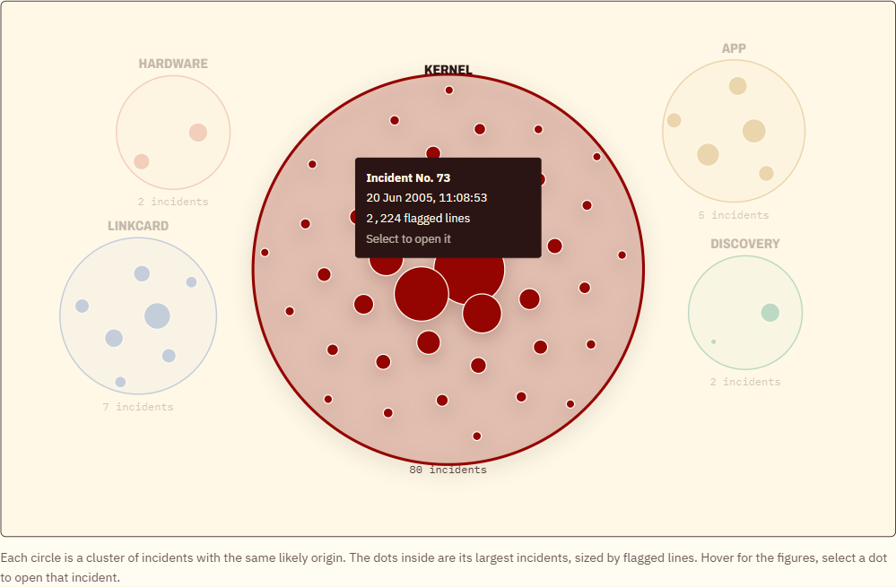
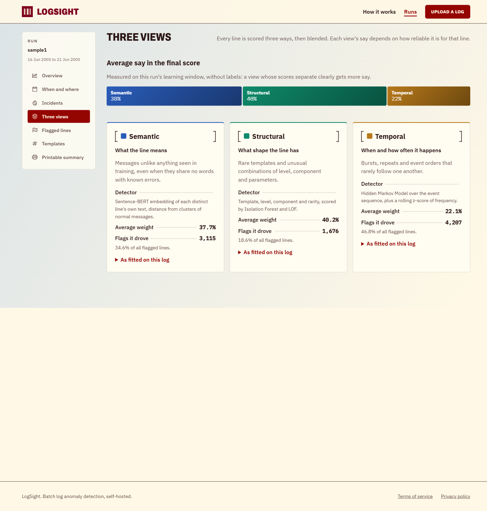

<h1 align="center">🔍 LogSight — Adaptive Multi-View Log Anomaly Detection & Root-Cause Localization</h1>

<p align="center">
  <b>Unsupervised Detection • Three Views • Reliability-Weighted Fusion • Explainable Flags • Root-Cause Ranking</b><br>
  <i>Sentence-BERT • Isolation Forest • LOF • HMM • SHAP • FastAPI • React</i>
</p>

<p align="center">
  
  
  
  
  
  
  
  
  
</p>

<p align="center">
  
  
  
</p>

```log
2005-06-03-15.42.50.363779  R02-M1-N0-C:J12-U11  RAS  KERNEL  INFO   instruction cache parity error corrected
...
[logsight]  learn   → first 60% of the log is "normal"
[logsight]  score   → semantic · structural · temporal
[logsight]  fuse    → weight each view by how reliable it is for this line
[logsight]  flag    → above the moving cutoff? → severity, evidence, incident, likely origin
```

---

## 🧭 Executive Summary

LogSight reads a system log, learns what "normal" looks like from the first part of it, and flags the lines that don't fit. **No labels are needed.**

Every log line is checked three ways:

| View | Asks | Detector |
|---|---|---|
| 🧠 **Semantic** | Does this message *mean* something unusual? | Sentence-BERT + KMeans prototypes (cosine distance) |
| 🧱 **Structural** | Does this line have an unusual *shape*? | Isolation Forest + Local Outlier Factor |
| ⏱️ **Temporal** | Is the *timing or order* unusual? | Hidden Markov Model + rolling z-score |

The three scores are blended by how **reliable** each view is for that line. Flagged lines get a severity and an explanation, are grouped into incidents, and the components most likely to have started each incident are ranked.

**Key results on the full BGL log (4,713,483 lines)**
- **AUC-ROC 0.7237** · **AUC-PR 0.1900** on a 942,697-line chronological test split
- AUC-ROC improved from **0.456 → 0.7237** after finding a data-leakage bug and down-weighting a weak view
- Equal-weight fusion (0.470) scored *worse* than the best single view (0.830), which is why LogSight weights views by reliability
- **AUC-ROC 0.658** on lines whose templates were **never seen** in training

> **Note:** research numbers come from version 1 (v1). The app runs version 2 (v2), which uses per-line embeddings and label-free view weighting.

---

## 📂 Repository Structure

<details>
<summary><b>Click to expand folder layout</b></summary>
<br>

```
📁 engine/                     → The ML pipeline
   ├── ingest.py               → Read and clean raw BGL lines
   ├── parse.py                → Drain3 template mining
   ├── features/               → Semantic, structural, temporal features
   ├── detection/              → Scoring, fusion, threshold, severity, drift
   ├── rca/                    → Incidents, co-occurrence, root-cause ranking
   ├── evidence.py             → Evidence package for flagged lines
   └── explain.py              → SHAP (structural), timing deviations, prototype examples

📁 backend/                    → FastAPI service
   ├── app/api/                → 22 REST endpoints
   ├── app/pipeline/           → Runs the engine stage by stage
   ├── app/db/                 → SQLite tables (9)
   ├── config/pipeline.yaml    → Every pipeline parameter
   └── tests/                  → pytest suite

📁 frontend/                   → React dashboard (Vite + TypeScript)

📁 data/
   ├── raw/samples/            → Five 50,000-line demo logs
   └── processed/              → Full-dataset research outputs

📁 research/                   → Notebooks + evaluation scripts (only place labels are read)
📁 docs/                       → Report, SRS, architecture, screenshots
📁 scripts/                    → make_bgl_samples.py
```

</details>

---

## 🌐 Background

Large systems write millions of log lines. Failures hide inside them as:
- **Unusual messages**, e.g. an error never seen before
- **Rare event types**, e.g. a FATAL line from an unexpected component
- **Bad timing**, e.g. a sudden burst or an odd order of events

Rule-based monitoring only catches problems someone predicted, and labelled failure data is rarely available. LogSight learns normal behaviour on its own, flags what doesn't fit, explains why, and suggests where the problem started.

| | |
|---|---|
| **Project Type** | Final-year project: research pipeline + full-stack application |
| **Domain** | AIOps · Log Analytics · Anomaly Detection |
| **Learning** | Unsupervised (labels used only for evaluation) |
| **Mode** | Batch: upload a log, get a report |

---

## 📊 Dataset Overview

| Property | Value |
|---|---|
| Source | BlueGene/L (BGL) supercomputer log, via Loghub |
| Period | 3 Jun 2005 → 4 Jan 2006 |
| Raw lines | 4,713,493 |
| Cleaned lines | 4,713,483 |
| Labelled anomalies | 348,460 (7.39%) |
| Drain3 templates | 1,819 (63.83% appear only once) |
| Median gap between lines | 0.026 s (very bursty) |
| Split (chronological) | 60% learning · 20% validation · 20% test |

<details>
<summary><b>Click to expand demo samples</b></summary>
<br>

| Sample | Period | Lines | Labelled anomalies |
|---|---|---|---|
| 1 of 5 | 16–21 Jun 2005 | 50,000 | 6.2% |
| 2 of 5 | 07–09 Jul 2005 | 50,000 | 2.4% |
| 3 of 5 | 17–20 Jul 2005 | 50,000 | 3.6% |
| 4 of 5 | 20–29 Sep 2005 | 50,000 | 7.5% |
| 5 of 5 | 09–15 Nov 2005 | 50,000 | 7.4% |

Each sample is a continuous stretch of the log, never shuffled, because the pipeline learns from order and timing.

</details>

---

## 🔧 How It Works

### 🏗️ Pipeline

```
BGL log ─► Clean & sort ─► Drain3 ─► Learning window (first 60%)
                                          │
              ┌───────────────────────────┼───────────────────────────┐
         🧠 Semantic                 🧱 Structural                ⏱️ Temporal
     SBERT → KMeans + cosine     Isolation Forest + LOF     HMM + rolling z-score
              └───────────────────────────┼───────────────────────────┘
                         Reliability-weighted fusion
                                          │
                     Rolling median + MAD threshold → Severity
                                          │
          ┌───────────────┬───────────────┼───────────────┐
      Evidence +      Incidents +     Drift check        │
        SHAP          root-cause         (KS)            │
          └───────────────┴───────────────┴───► SQLite ─► FastAPI ─► React dashboard
```


### ⚖️ Fusion, Threshold & Severity

| Step | What it does |
|---|---|
| **Reliability** | Each view gets a per-line trust score (prototype density, template familiarity, timing stability) |
| **Weights** | Softmax of the trust scores × each view's quality on the learning window, measured without labels |
| **Threshold** | Rolling median + 1.5 × 1.4826 × MAD over the last 200 lines; robust to the anomalies it's looking for |
| **Severity** | Score + persistence + frequency + rarity → Low · Medium · High · Critical |

### 💡 Explainability

Every one of the 200 most severe flagged lines gets an evidence package:

| Level | Answer | How |
|---|---|---|
| **Which view?** | Shapley waterfall: each view's exact share of the final score | `w × (score − normal average)` |
| **Which feature?** | Structural: real **SHAP** on the Isolation Forest · Temporal: biggest deviations from normal | `shap.TreeExplainer`, robust z-scores |
| **What's normal?** | Nearest normal line of the same template + closest normal prototype message | Cosine similarity |

### 🧩 Root-Cause Localization

1. **Incidents:** flagged lines within 10 minutes of each other are chained together
2. **Co-occurrence:** which components show up in the same incidents
3. **Signature:** templates and components per incident
4. **Ranking:** appeared first (35%) · severity (30%) · frequency (20%) · co-occurrence (15%)

> Root causes are **ranked candidates based on correlation**, not proof. BGL has no service-dependency map.

---

## 📈 Key Results

### 🎯 Detection (full BGL, test split)

| Metric | Value |
|---|---|
| AUC-ROC | **0.7237** |
| AUC-PR | **0.1900** (≈ 3.9× random) |
| Precision | 0.0806 |
| Recall | 0.1625 |
| F1 | 0.1078 |
| Flagged / true anomalies | 93,244 / 46,283 |

### 🔧 How the score was fixed

| Stage | Semantic | Structural | Temporal | Fused |
|---|:---:|:---:|:---:|:---:|
| First attempt | 0.306 | 0.547 | 0.428 | 0.456 ❌ |
| + view quality multipliers | 0.306 | 0.547 | 0.428 | 0.554 |
| + leakage fix | 0.306 | **0.830** | 0.428 | **0.7237** ✅ |

### 🧪 Ablation (equal weights)

| Configuration | AUC-ROC | AUC-PR |
|---|:---:|:---:|
| Semantic only | 0.306 | 0.063 |
| **Structural only** | **0.830** | **0.657** |
| Temporal only | 0.428 | 0.052 |
| Semantic + structural | 0.465 | 0.067 |
| All three (equal weights) | 0.470 | 0.048 |

### 🆕 Unseen vs seen templates

| Subset | Lines | Anomaly rate | AUC-ROC | AUC-PR |
|---|---|:---:|:---:|:---:|
| Unseen templates | 749,626 (79.5%) | 5.83% | 0.658 | 0.252 |
| Seen templates | 193,071 | 1.35% | 0.936 | 0.103 |

### 🖥️ App run, BGL sample 1 (v2)

| Metric | Value |
|---|---|
| Lines · templates | 50,000 · 194 |
| Flagged lines | 8,998 (18.0%) |
| Incidents | 96 |
| View weights (sem / str / tem) | 37.7% / 40.2% / 22.1% |
| Severity | Critical 180 · High 1,170 · Medium 3,149 · Low 4,499 |

---

## 🎛️ Dashboard

<details>
<summary><b>Click to expand pages and screenshots</b></summary>
<br>

| Page | Shows |
|---|---|
| **Upload / Receipt** | Upload a log and watch each stage run live |
| **Overview** | Headline numbers, anomaly timeline, severity ring |
| **When & Where** | Anomalies by day/hour and by component |
| **Incidents** | 2D root-cause cluster map + "How this root cause was chosen" |
| **Three Views** | Each view's weight, flags driven, fitted detector facts, drift check |
| **Flagged Lines** | Line detail with Shapley waterfall, SHAP features and evidence |
| **Anomaly Report** | Printable report + JSON download with run metadata |






</details>

---

## ▶️ Run It

<details>
<summary><b>Click to expand setup steps</b></summary>
<br>

**Requirements:** Python 3.10 and Node 22

```bash
# 1. Python environment (from the project root)
python -m venv .venv
.venv/Scripts/python -m pip install -r requirements.txt     # .venv/bin/python on Linux/macOS

# 2. Backend (from backend/), with API docs at http://127.0.0.1:8000/docs
../.venv/Scripts/python -m uvicorn app.main:app

# 3. Frontend (from frontend/), opens at http://localhost:5173
npm install
npm run dev
```

**Or with Docker** (app at http://localhost:8080):
```bash
docker compose up --build
```

**Load the full-dataset research results instead of running the pipeline:**
```bash
cd backend && ../.venv/Scripts/python -m app.cli import-artifacts
```

**Tests:**
```bash
python -m pytest backend/tests
```

Demo logs are in `data/raw/samples/`. Upload one at `/upload`.

</details>

---

## 🔍 Insights

<details>
<summary><b>Insight 1: Weighting matters more than adding views</b></summary>
<br>

Averaging all three views equally (0.470) did worse than structural alone (0.830). The weak views dragged the strong one down. Weighting each view by reliability recovered most of the gap (0.7237).

</details>

<details>
<summary><b>Insight 2: One leaked feature was the biggest error</b></summary>
<br>

Template frequency was first counted over the whole log, including the test period. Counting it on the learning window only raised structural AUC from 0.547 to 0.830.

</details>

<details>
<summary><b>Insight 3: Unseen patterns are the normal case</b></summary>
<br>

79.5% of test lines had templates never seen during learning. A detector that needs familiar templates would miss most of the log.

</details>

<details>
<summary><b>Insight 4: How you embed text changes everything</b></summary>
<br>

One embedding per template made the semantic view blind inside a template: 192 distinct scores and 0 flags driven. Embedding each line's own text gave 21,111 distinct scores and 3,115 flags driven.

</details>

<details>
<summary><b>Insight 5: Drift tests need a control</b></summary>
<br>

Consecutive chunks of BGL looked "drifted" because events come in bursts. A shuffle test on the learning window (KS ≈ 0.001, p > 0.3) showed the data itself was stable.

</details>

---

## ⚠️ Limitations

| # | Limitation |
|:---:|---|
| 1 | BGL format only; batch processing, no live streaming |
| 2 | The full 4.7M-line log takes hours and several GB of RAM |
| 3 | Research metrics are from v1; v2 isn't yet evaluated at full scale |
| 4 | λ and the v1 view multipliers were tuned on the test split; the validation split is unused |
| 5 | Severity is relative: about 2% of flags are always Critical |
| 6 | Root causes are correlation-based candidates, not proven causes |

---

## 🚀 Tech Stack

<p align="center">
  
  
  
  
  
  
</p>

---

## 🙌 Team

**Jegadeeswaran D** · **Karthick S** · **Koushal V**
Department of Artificial Intelligence and Data Science


---

## 🏷️ Tags

`log-anomaly-detection` `aiops` `unsupervised-learning` `multi-view-learning` `sentence-bert` `isolation-forest` `local-outlier-factor` `hidden-markov-model` `shap` `explainable-ai` `root-cause-analysis` `drain3` `fastapi` `react` `bgl-dataset`

---

**📌 Labels Note**

> The app **never reads labels**. BGL's anomaly labels are used only in `research/evaluation/` to measure how well the research pipeline performs.

<div align="center">


<br/>

<i>✨ Learn what normal looks like, flag what doesn't, explain why, and point to where it started. ✨</i>

</div>
